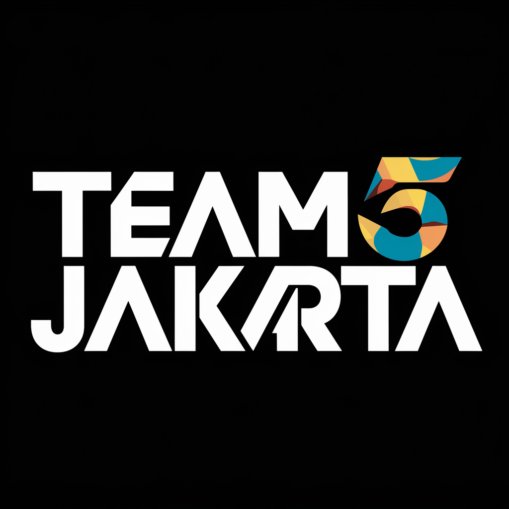

 

# Team 5 - Bike Sales in Europe
We are creating a website to visualize and showcase our findings and recommendations that we got from the dataset. 

## 🧰 Technologies Used

| Technology                                                            | Description                                                                                               |
| --------------------------------------------------------------------- | --------------------------------------------------------------------------------------------------------- |
| [HTML](https://developer.mozilla.org/en-US/docs/Web/HTML)             | Foundation for interpret and compose text, images, and other material into visible or audible web pages.  |
| [CSS](https://developer.mozilla.org/en-US/docs/Web/CSS)               | Responsible for adding style to a web page by dictating how a site is displayed on a browser.             |
| [JavaScript](https://developer.mozilla.org/en-US/docs/Web/JavaScript) | Responsible for dynamic and interactive web page to interact with visitors and execute complex actions.   |
| [Chart.js](https://www.chartjs.org/)                                  | Responsible for JavaScript charting library for the modern web.                                           |

## 🌐 Links

| Website                                                                           | Description                                            |
| --------------------------------------------------------------------------------- | ------------------------------------------------------ |
| [Demo](https://kampus-merdeka-software-engineering.github.io/km-feb24-jakarta-5/) | Powered by [GitHub Pages](https://pages.github.com/).  |
| [Final](https://km-feb24-jakarta-5.vercel.app/)                                   | Powered by [Vercel](https://vercel.com/).              |

## ⭐ Team Members

| Name                                                               | Role               |
| ------------------------------------------------------------------ | ------------------ |
| [Mohammad Firmansyah Suryo Baskoro](https://github.com/Firmeteran) | Project Leader     |
| [Rafif Rabbani](https://github.com/rafif125)                       | Frontend Engineer  |
| [Ehud Gratia Manullang](https://github.com/ehudgratia)             | Frontend Engineer  |
| [Nada Adilah](https://github.com/Nadaadilah27)                     | Frontend Engineer  |
| [Risma Dhiva Syabila](https://github.com/rismasyblla)              | Frontend Engineer  |
| [Ananda Eka Satria](https://github.com/sattria19)                  | Deployment Team    |
| [Clarissa Ghavira](https://github.com/itsmecg)                     | Pitch Deck Team    |
| [Adesty Dewi Nurcahyani](https://github.com/adestydnc)             | Pitch Deck Team    |
| [So George Fredericho](https://github.com/SoGeorgeF)               | Pitch Deck Team    |
| [Rizki Fatimah](https://github.com/hellokiki28)                    | Quality Assurance  |
| [Wahyuni Madina](https://github.com/wahyunimadina)                 | Quality Assurance  |
| [Arya Setya](https://github.com/AryaS21)                           | Quality Assurance  |
